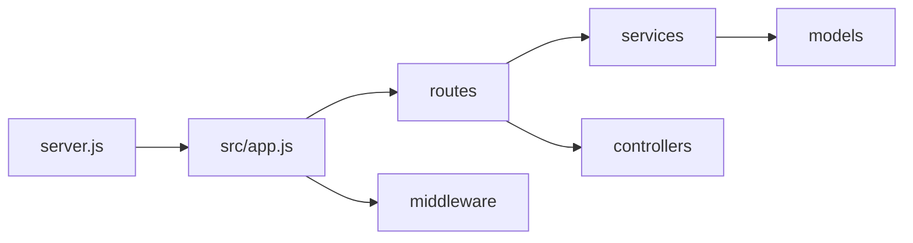

# Backend Setup and API Docs

## Current state

- [backend/package.json](backend/package.json): Has Express, Mongoose, cors, dotenv, helmet, morgan, express-rate-limit, uuid; still lists **@anthropic-ai/sdk** (docs were updated to Gemini).
- No backend source files exist: no `server.js`, no [backend/src](backend/src) code. Scripts expect **server.js at backend root** (`nodemon server.js`).
- Backend uses **CommonJS** (`"type": "commonjs"`); all new code will use `require`/`module.exports`.

---

## 1. Packages

**Install**

- **@google/generative-ai** — Gemini API (replace Anthropic in usage; remove `@anthropic-ai/sdk` in a later step or leave removal to you).
- **swagger-ui-express** — Serve Swagger UI.
- **swagger-jsdoc** (optional) — Generate OpenAPI from JSDoc; alternative is a static OpenAPI file.

**Recommendation:** Use a **static OpenAPI 3.0 JSON** (e.g. [backend/src/openapi.json](backend/src/openapi.json)) and `swagger-ui-express` to serve it at `GET /api-docs`. No extra codegen; document the six endpoints (POST/GET sessions, GET/POST leaderboard, POST cards/generate, GET health) with request/response schemas.

**Remove (optional):** `@anthropic-ai/sdk` after Gemini is in place.

---

## 2. Backend layout (from PRD)

| Path                                                                             | Purpose                                                                                                                                                                                                                                                       |
| -------------------------------------------------------------------------------- | ------------------------------------------------------------------------------------------------------------------------------------------------------------------------------------------------------------------------------------------------------------- |
| [backend/server.js](backend/server.js)                                           | Entry: load dotenv, connect Mongoose to `MONGO_URI`, require `./src/app`, listen on `PORT`. Exit on connection error.                                                                                                                                         |
| [backend/src/app.js](backend/src/app.js)                                         | Create Express app: `cors` (use `ALLOWED_ORIGIN`), `helmet`, `morgan`, `express.json()`, rate-limit middleware, mount `/api` routes, `GET /api/health`, mount `/api-docs` (Swagger UI with OpenAPI spec), then global error handler.                          |
| [backend/src/routes/cards.js](backend/src/routes/cards.js)                       | `POST /api/cards/generate`: read `mode` from body; 70/30 built-in vs Gemini (use `GEMINI_TOP_UP_RATE`); call `geminiService.generateCard(mode)` when using AI; on failure or for 70% path use built-in deck; return JSON card.                                |
| [backend/src/routes/sessions.js](backend/src/routes/sessions.js)                 | `POST /api/sessions` — validate body, save via Session model, return `{ sessionId }`. `GET /api/sessions/:id` — find by `sessionId`, return session or 404.                                                                                                   |
| [backend/src/routes/leaderboard.js](backend/src/routes/leaderboard.js)           | `GET /api/leaderboard` — query params `limit`, `sort`; list from Leaderboard model. `POST /api/leaderboard` — validate body (`displayName`, `teamName`, `score`, `sessionId`), save, return 201.                                                              |
| [backend/src/models/Session.js](backend/src/models/Session.js)                   | Mongoose schema per PRD §8.1: `sessionId`, `playedAt`, `teams[]`, `rounds[]`, `winner`, `totalRounds`. Export model.                                                                                                                                          |
| [backend/src/models/Leaderboard.js](backend/src/models/Leaderboard.js)           | Mongoose schema per PRD §8.2: `displayName`, `teamName`, `score`, `sessionId`, `achievedAt`. Export model.                                                                                                                                                    |
| [backend/src/services/geminiService.js](backend/src/services/geminiService.js)   | `generateCard(mode)`: use `@google/generative-ai` with `GEMINI_API_KEY` and `GEMINI_MODEL`; prompts per PRD §6.2; parse JSON for trivia/fillinblank/taboo; return plain text for other modes. On any error, return `null` so route can fall back to built-in. |
| [backend/src/data/builtinCards.js](backend/src/data/builtinCards.js)             | Export object keyed by mode (e.g. `sing`, `act`, `trivia`, …) with arrays of card objects/strings. Used when not calling Gemini or when Gemini fails. Minimal set per mode (e.g. 2–3 items each) so the app runs without Gemini.                              |
| [backend/src/middleware/errorHandler.js](backend/src/middleware/errorHandler.js) | 4-arg Express error handler: log error, send `res.status(err.status                                                                                                                                                                                           |
| [backend/src/middleware/rateLimiter.js](backend/src/middleware/rateLimiter.js)   | Use `express-rate-limit` with a sensible window (e.g. 100 req/15 min per IP) for `/api` and export the middleware.                                                                                                                                            |
| [backend/src/openapi.json](backend/src/openapi.json)                             | OpenAPI 3.0 document: info, servers, paths for `/api/health`, `/api/cards/generate`, `/api/sessions`, `/api/sessions/:id`, `/api/leaderboard` (GET/POST). Request/response schemas for session and leaderboard.                                               |

---

## 3. Implementation details

- **server.js**  
  - `require('dotenv').config()` (or `require('dotenv/config')`).  
  - `mongoose.connect(process.env.MONGO_URI)`.  
  - On success: `require('./src/app')` and `app.listen(PORT)`.  
  - On failure: `console.error`, `process.exit(1)`.
- **app.js**  
  - Mount route modules under `/api` (e.g. `app.use('/api/cards', cardsRoutes)`, `app.use('/api/sessions', sessionsRoutes)`, `app.use('/api/leaderboard', leaderboardRoutes)`).  
  - Health: `app.get('/api/health', (req, res) => res.status(200).json({ status: 'ok' })` (or similar).  
  - Swagger: `app.use('/api-docs', swaggerUi.serve, swaggerUi.setup(openApiDocument))` with `openApiDocument` loaded from `./openapi.json` (path relative to `src`).  
  - Apply `rateLimiter` before routes; apply `errorHandler` last.
- **cards route**  
  - If `Math.random() < GEMINI_TOP_UP_RATE`, call `geminiService.generateCard(mode)`; if result is null/throws, use built-in. Else use built-in.  
  - Pick random item from `builtinCards[mode]`; if mode is missing, use a safe default or 400.  
  - Respond with the same shape the frontend expects (string for simple modes, object for trivia/fillinblank/taboo).
- **geminiService**  
  - Use `require('@google/generative-ai')` and `GoogleGenerativeAI(process.env.GEMINI_API_KEY)`.  
  - `getGenerativeModel({ model: process.env.GEMINI_MODEL, generationConfig: { maxOutputTokens: 300 } })`.  
  - For each mode, use the PRD prompts; for JSON modes parse response (strip markdown fences) and return object; for text modes return string.  
  - Wrap in try/catch; on error return `null` (or throw and let route catch and fall back).
- **Sessions/leaderboard routes**  
  - Use `Session` and `Leaderboard` models with `sessionId` as the unique key for sessions.  
  - Validate required fields and return 400 when invalid.
- **Environment**  
  - Rely on existing [backend/.env](backend/.env): `PORT`, `MONGO_URI`, `GEMINI_API_KEY`, `GEMINI_MODEL`, `GEMINI_TOP_UP_RATE`, `ALLOWED_ORIGIN`. No code changes to .env in this plan.

---

## 4. Order of work

1. **Packages:** Install `@google/generative-ai`, `swagger-ui-express`; optionally remove `@anthropic-ai/sdk`.
2. **Data and models:** Add `builtinCards.js`, then `Session.js` and `Leaderboard.js`.
3. **Service:** Implement `geminiService.js` with fallback behavior (return null on failure).
4. **Middleware:** Add `errorHandler.js` and `rateLimiter.js`.
5. **Routes:** Implement `cards.js`, `sessions.js`, `leaderboard.js`.
6. **OpenAPI:** Add `openapi.json` describing all six endpoints.
7. **App and server:** Wire `app.js` (cors, helmet, morgan, json, rate limit, routes, health, Swagger, error handler), then add `server.js` at backend root.

After this, running `npm run dev` from [backend](backend) with a valid `.env` and MongoDB should start the server, serve the API, and expose docs at **GET /api-docs**.