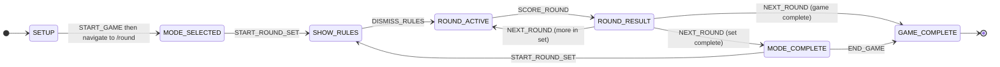

# Game Progression Logic, FSM, and UX Overhaul

## 1. Root Cause Analysis: Why Rounds Reset Mid-Cycle

### 1.1 Current flow and where it can break

- **Phase is derived, not stored.** [RoundPage.tsx](frontend/src/pages/RoundPage.tsx) uses `derivePhase(selectedMode, roundsPerMode, roundsPlayedInSet, rulesDismissedForSet)` to get `'selecting_set' | 'rules' | 'playing'`. Any time that formula evaluates to `'selecting_set'` (e.g. `!selectedMode` or `roundsPlayedInSet >= roundsPerMode`), the UI shows mode selection again.
- **Single source of premature reset:** In [gameContextState.ts](frontend/src/context/gameContextState.ts), `SCORE_ROUND` sets `setComplete = nextPlayedInSet >= state.roundsPerMode`. When `setComplete` is true, it sets `selectedMode: null`, `roundsPerMode: 0`, `roundsPlayedInSet: 0`. So the only way to see mode selection again before N rounds is for `setComplete` to become true too early.

**Likely causes:**

| Cause                     | Explanation                                                                                                                                                                               |
| ------------------------- | ----------------------------------------------------------------------------------------------------------------------------------------------------------------------------------------- |
| **Double-submit**         | User double-taps score (Correct / Incorrect). Two `SCORE_ROUND` dispatches run; `roundsPlayedInSet` jumps by 2. With N=2, one double-tap can complete the set.                            |
| **Capping confusion**     | `RoundSetConfig` caps "rounds in set" to `remainingRounds` (game total minus rounds played). User may intend 10 but only 5 remain, so after 5 rounds the set completes and feels "early". |
| **No set progress in UI** | Header shows "Round X of {totalRounds}" (game total), not "Round X of N in [Mode]". Users don't see that the current mode is locked for N turns and assume the mode changed.              |

No evidence was found that TanStack Query refetches or route transitions reset game context; [GameProvider](frontend/src/context/GameContext.tsx) uses a stable `useReducer` and is not keyed, so state survives navigation.

### 1.2 Intended semantics (to enforce)

- One "round" = one team's turn (one card, one score). So "N rounds in this set" = N team-turns, all with the same mode.
- Mode must stay locked until exactly N rounds are scored for that set.
- Only after N rounds should `selectedMode` / `roundsPerMode` be cleared and the user offered "new mode" or "end game".

---

## 2. Revised State Architecture

### 2.1 Explicit game phase (FSM)

Replace derived `roundPhase` with a single stored **game phase** and strict transitions.

**Proposed phases:**

- **SETUP** – Not yet started (idle or on Setup page).
- **MODE_SELECTED** – User has chosen mode + N rounds; mode is locked; next is rules or first round.
- **SHOW_RULES** – Showing rules for the selected mode; must dismiss to play.
- **ROUND_ACTIVE** – A card is being played (fetch/display/score). Mode is locked.
- **ROUND_RESULT** – Round scored; showing result screen; "Next" goes to next round or mode complete.
- **MODE_COMPLETE** – N rounds in this set are done; show celebration + "Next mode" or "End game".
- **GAME_COMPLETE** – All game rounds done; final scoreboard.

**State fields to add/keep:**

- `gamePhase: GamePhase` (replaces deriving phase from multiple flags).
- `selectedMode: CardMode | null` (unchanged).
- `totalRoundsForMode: number` (rename/clarify `roundsPerMode` – total rounds for current set).
- `currentRoundIndexInSet: number` (rename/clarify `roundsPlayedInSet` – 0-based index of current round in set).
- `modeLocked: boolean` – derived or stored: true when `gamePhase` is SHOW_RULES, ROUND_ACTIVE, or ROUND_RESULT and set not complete.

**Ownership:**

- **Client (Context/Reducer or Zustand):** All of the above, plus `teams`, `rounds`, `currentTeamIndex`, `roundsPerTeam`, `status`, `usedCards`. No phase transition or round advancement should be driven by server or TanStack Query.
- **Server / TanStack Query:** Card generation, session save, leaderboard, admin APIs only. Queries must not trigger phase transitions or resets.

### 2.2 FSM transition diagram

Transitions must be **only** via dispatched actions (e.g. `START_ROUND_SET`, `DISMISS_RULES`, `SCORE_ROUND`, `NEXT_ROUND`, `END_GAME`). No transition in `useEffect` or as a side effect of query success/refetch.

### 2.3 Recommended implementation approach

- **Keep `useReducer`** for game state; it is already in place and sufficient. No need for XState unless you want visual tooling or more complex guards.
- Add **phase** to the reducer state and a small **transition helper** (e.g. `getNextPhase(state, action)`) so that every action that can change phase goes through one place and logs/guards can be added easily.
- **Zustand** is optional: use only if you want to avoid prop-drilling or need game state outside the tree (e.g. analytics); the same FSM can live in a Zustand store with a single `dispatch(action)`-style API.

---

## 3. Round Completion and Edge Cases

### 3.1 Guarantee N rounds before mode change

- In the reducer, when handling `SCORE_ROUND`, compute `setComplete = (currentRoundIndexInSet + 1) >= totalRoundsForMode`. Only when `setComplete` is true:
  - Set `gamePhase = MODE_COMPLETE` (or transition to a "set complete" state that shows the celebration screen).
  - Do **not** clear `selectedMode` until the user explicitly starts a new set or ends the game (so MODE_COMPLETE screen can show "Sing complete" and still know the mode).
- Optionally keep `selectedMode` and `totalRoundsForMode` in state during MODE_COMPLETE for UI (badge, summary), and clear them only on `START_ROUND_SET` or `END_GAME`.

### 3.2 Edge cases to handle explicitly

- **Double-submit:** In [RoundPage](frontend/src/pages/RoundPage.tsx) (or in the component that calls `onScore`), guard `handleScore`: e.g. a ref `scoredRef` set to true when scoring and reset when entering ROUND_ACTIVE for the next round, or disable the score buttons after first tap until navigation. Prefer a single source (e.g. "submit round" action) that ignores duplicate calls when already in ROUND_RESULT.
- **Timer expiration / skip / AI fallback:** Any path that ends the current card (timer, skip, fallback) must go through the same scoring flow (one `SCORE_ROUND` per round) and then transition to ROUND_RESULT. No extra dispatches.
- **Card exhaustion / API failure:** Fallback card or error retry must not dispatch any game action. Only when the user scores does `SCORE_ROUND` fire. So no change to round count from fetch failure.
- **Query invalidation:** Ensure no query invalidation is tied to game phase. Card generation is a mutation; avoid invalidating it in a way that remounts or re-runs effects that could look like "new round" (e.g. don’t invalidate on window focus during ROUND_ACTIVE).

---

## 4. TanStack Query Best Practices

- **Separate server from client state:** Cards, sessions, leaderboard = server. Game phase, rounds, mode lock = client. Do not derive game phase from query state.
- **Refetch during gameplay:** In [main.tsx](frontend/src/main.tsx), consider a game-aware default: e.g. when `status === 'playing'`, disable `refetchOnWindowFocus` for the session (or use a custom hook that reads game status and sets `refetchOnWindowFocus: false` for card-related queries). Alternatively, scope refetch disabling to the card mutation’s query key so other queries (e.g. leaderboard) can still refetch if desired.
- **Card request semantics:** Keep card generation as a **mutation** (no automatic refetch). Key the mutation or its cache by `sessionId` + current round index (or round id) so that back/forward doesn’t reuse the wrong card. When advancing to the next round, the component that needs a new card should call the mutation again; do not rely on cache invalidation to "clear" the previous card – explicitly request the next card when entering ROUND_ACTIVE for the next turn.
- **No duplicate requests:** The effect in RoundPage that calls `generateCard` when `roundPhase === 'playing' && !card && !isPending` is correct in intent. With an FSM, trigger card fetch only when transitioning into ROUND_ACTIVE (or when entering the phase with no card yet). Use a single effect that depends on `gamePhase` and a "round id" (e.g. `state.rounds.length` or `currentRoundIndexInSet`) so one round = one fetch.

---

## 5. UX Improvements (Research-Aligned)

- **Progress indicator:** Show both:
  - **Set progress:** "Round 3 of 10 in Sing" (or "Set round 3 of 10") so users see the mode is locked.
  - **Game progress:** "Game round 7 of 20" (optional, or in a secondary line).
- **Locked mode badge:** While in SHOW_RULES, ROUND_ACTIVE, ROUND_RESULT (and set not complete), show a persistent badge: e.g. "Sing – 3/10" so mode lock is obvious.
- **Scoreboard:** Keep scoreboard visible on Round and Result pages (already present); ensure it doesn’t collapse on mobile in a way that hides scores.
- **Transitions:** Use the same FSM to drive AnimatePresence keys (e.g. key by `gamePhase` or phase + round index) so transitions are predictable (e.g. ROUND_ACTIVE → ROUND_RESULT → ROUND_ACTIVE).
- **Mode complete screen:** After N rounds, show a short **MODE_COMPLETE** screen: "Sing complete!" with light celebration, then CTAs: "Next mode" (→ mode picker) and "End game" (→ final scoreboard). This avoids dropping users straight into the mode picker and makes the end-of-set moment clear.
- **Restart / back:** Provide an explicit "End game early" in a menu or header during play; do not rely on browser back for ending the game. Back button behavior: consider preventing accidental exit (e.g. confirm "Leave game?" when status is playing) or keep back as history-only and never use it to reset state.

---

## 6. User Journey (Strict Flow)

Target flow:

1. **Home** → Start game.
2. **Setup** → Teams, difficulty, etc. → Start game (dispatch + navigate to `/round`).
3. **Mode selection** (MODE_SELECTED or first time after setup) → Choose mode + N rounds → Lock mode.
4. **Rules** (SHOW_RULES) → Dismiss → Enter round loop.
5. **Round loop** (ROUND_ACTIVE ↔ ROUND_RESULT) – N times, same mode. No mode reselection in between.
6. **Mode complete** (MODE_COMPLETE) → Celebration + "Next mode" or "End game".
7. If "Next mode" → back to step 3. If "End game" or game total reached → **Final scoreboard** (GAME_COMPLETE).

Eliminate:

- Any path that shows mode picker before N rounds are done (enforced by FSM: only MODE_COMPLETE or initial MODE_SELECTED show picker).
- State resets from navigation or refetch (no phase transition from query/react effects).
- Confusing back-button behavior: document or add a single "End game" action instead of relying on back.

---

## 7. Breaking Changes and Migration

- **GameState shape:** New field `gamePhase`; possible renames `roundsPerMode` → `totalRoundsForMode`, `roundsPlayedInSet` → `currentRoundIndexInSet`. Existing `status: 'idle' | 'playing' | 'finished'` can remain; map `gamePhase` to route and UI.
- **Actions:** New: `DISMISS_RULES`, `NEXT_ROUND` (optional if you fold "next" into existing flow). Possibly split "score and go to result" vs "next round" so that ROUND_RESULT is a first-class phase and "Next" button dispatches `NEXT_ROUND` (reducer then moves to ROUND_ACTIVE or MODE_COMPLETE or GAME_COMPLETE).
- **RoundPage / ResultPage:** RoundPage will branch on `gamePhase` (and MODE_COMPLETE may be a dedicated block or a small sub-screen). ResultPage becomes the ROUND_RESULT view; "Next" dispatches `NEXT_ROUND`; navigation to `/round` or `/scoreboard` or mode-complete UI is driven by reducer/phase.
- **RoundSetConfig:** Still used when `gamePhase === MODE_SELECTED` (or when MODE_COMPLETE and user chose "Next mode"). No change to its API; it still calls `onComplete(mode, N)` which will dispatch `START_ROUND_SET` and transition to SHOW_RULES.

---

## 8. Implementation Order (Recommended)

1. **Reducer + FSM:** Add `gamePhase` and transition logic to [gameContextState.ts](frontend/src/context/gameContextState.ts); implement all transitions and keep `selectedMode` / `totalRoundsForMode` / `currentRoundIndexInSet` in sync. No UI yet.
2. **Double-submit guard:** Add guard in RoundPage (or in score callback) so that a second score for the same round is ignored.
3. **RoundPage / ResultPage by phase:** Switch RoundPage and ResultPage to use `gamePhase` instead of `derivePhase`; add MODE_COMPLETE UI and "Next" dispatching `NEXT_ROUND`.
4. **Progress and badge:** Add "Round X of N in [Mode]" and locked-mode badge.
5. **TanStack Query:** Disable refetch-on-window-focus for gameplay; ensure one card request per round and no invalidation-based phase changes.
6. **Polish:** Mode-complete celebration, "End game early" control, and back-button/confirmation if desired.

This order keeps state correct first, then UI, then server-state and polish.